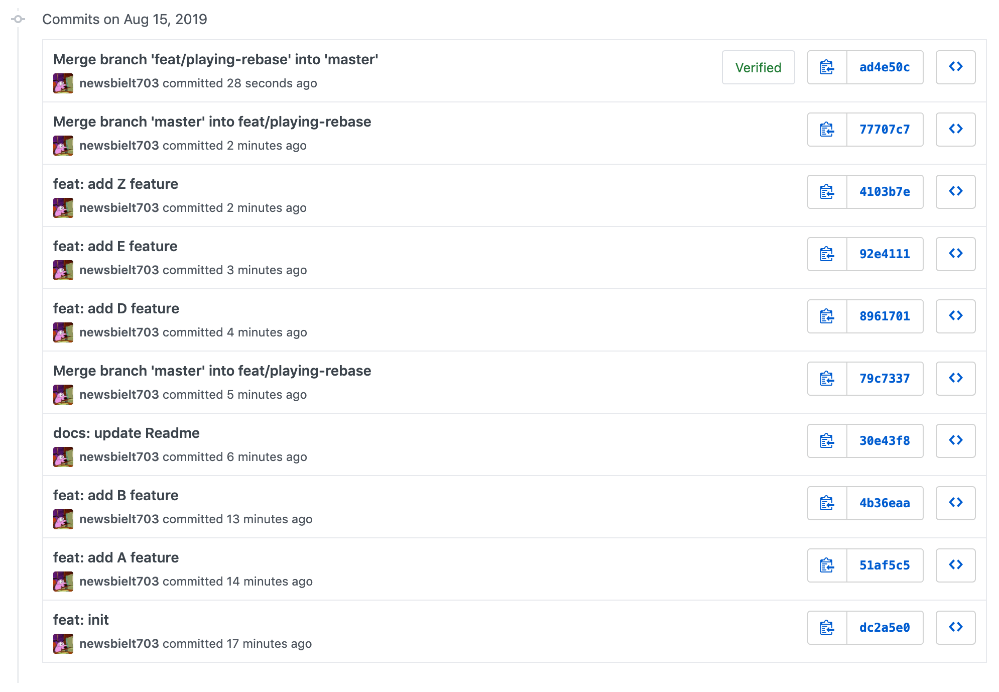

# `git rebase` 與他的小夥伴 <br/> `git push --force-with-lease`

## 前言

### 怎麼用 rebase

如果我處在`feat/playing-rebase`分支，執行`git rebase master`，這時就會把`feat/playing-rebase`中所有 master 沒有的 commit 接到 master 上來修改`feat/playing-rebase`的歷史，注意 rebase 是修改當前分支的歷史。

這篇不是要講基本指令怎麼下，你可以參考[官方文件](https://git-scm.com/docs/git-rebase)。

### Why?

這篇文章是分享我使用的原因與時機並且分享似乎很多人不知道的`git push --force-with-lease`。已經很多文章在講`git rebase`了，但很多都沒有提到應該要跟`git push --force-with-lease`一起使用，對我來說他們就是密不可分的。

## 為什麼我愛用`git rebase`

### 專案的歷史非常整潔直觀

`merge` 會造成不必要的 merge commit，或許可以 fast-forward 的情況 `merge` 也可以不產生多餘的 commit，但遇到衝突就沒轍了，而相反的`rebase`就沒這煩惱了。

再來`rebase` 讓歷史很清晰，就像海賊王合體一樣，就算合體完成我還是一看就知道是由什麼組成，來自哪裡都擺在一塊：


而 merge 就像七龍珠合體，合體完都摻在一起了：


但就算我愛用`rebase`也不代表都不用`merge`了，merge commit 可以幫助追蹤這一坨 commit 來自哪裡。所以我會在自己工作的分支上總是使用`rebase`來解衝突，而當要把分支併入主分支時使用`merge`。(這只是我喜歡的做法，實際上取決於團隊共識)

> Talk is cheap, show me screenshot.

這是不用 `rebase` 所造成的歷史:



這是善用 `rebase` 所造成的歷史:


### 自由修改所有 commits

`git rebase -i` or `git rebase --interactive`

進入 vim 編輯器告訴 rebase 你要做哪些改變：

```
pick 30e43f8 docs: update Readme
pick 4103b7e feat: add Z feature
pick b962eeb feat: add A feature
pick f296540 feat: add B feature
pick a49b581 feat: add D feature
pick 0967d97 feat: add E feature

# Rebase dc2a5e0..0967d97 onto dc2a5e0 (6 commands)
#
# Commands:
# p, pick <commit> = use commit
# r, reword <commit> = use commit, but edit the commit message
# e, edit <commit> = use commit, but stop for amending
# s, squash <commit> = use commit, but meld into previous commit
# f, fixup <commit> = like "squash", but discard this commit's log message
# x, exec <command> = run command (the rest of the line) using shell
# b, break = stop here (continue rebase later with 'git rebase --continue')
# d, drop <commit> = remove commit
# l, label <label> = label current HEAD with a name
# t, reset <label> = reset HEAD to a label
# m, merge [-C <commit> | -c <commit>] <label> [# <oneline>]
# .       create a merge commit using the original merge commit's
# .       message (or the oneline, if no original merge commit was
# .       specified). Use -c <commit> to reword the commit message.
#
# These lines can be re-ordered; they are executed from top to bottom.
```

你可以自由移動 commit 位置，他會乖乖造著你重新排列，當然有衝突的話會停下來讓你解決：

```
    pick 4103b7e feat: add Z feature
    pick 0967d97 feat: add E feature
    pick a49b581 feat: add D feature
    pick f296540 feat: add B feature
    pick b962eeb feat: add A feature
    pick 30e43f8 docs: update Readme
```

常常我突然發現 commit message 寫的不滿意，把 pick 改成 r，他會讓修改：

```diff
    pick 30e43f8 docs: update Readme
-   pick 4103b7e feat: add Z feature
+   r 4103b7e feat: add Z feature
    pick b962eeb feat: add A feature
    pick f296540 feat: add B feature
    pick a49b581 feat: add D feature
    pick 0967d97 feat: add E feature
```

偶爾我發現某個 commit 漏做了一小點事，我不想為了他再造一個 commit，把 pick 改成 e，就會 checkout 到那個分支讓你盡情修改：

```diff
    pick 30e43f8 docs: update Readme
-   pick 4103b7e feat: add Z feature
+   e 4103b7e feat: add Z feature
    pick b962eeb feat: add A feature
    pick f296540 feat: add B feature
    pick a49b581 feat: add D feature
    pick 0967d97 feat: add E feature
```

其他指令也是一樣用法，順便提一下`fixup`，我常常提交完 commit 後，馬上發現少做一小點東西，我會把他補上在新的 commit，message 就隨便打，再把他 fixup 併進去就解決了(其實還有很多方法這邊就不贅述了)。

## 小夥伴 `git push --force-with-lease`

### 作用

`rebase` 非常好用但是有它的副作用，rebase 代表修改了歷史，如果只在本地沒有影響，但如果有推到遠端分支，這代表你得`git push -f`，但全世界都知道`git push -f`多危險。

所以我只用`git push --force-with-lease`，它會去檢查遠端分支是否有其他人做新的提交，如果不如它預期就會拒絕你 push，這時我就會知道我不能 rebase 了，乖乖做新的 commit 補救吧。

被拒絕如下：

```shell
git push origin master --force-with-lease
To github.com:newsbielt703/test-git-push--force-with-lease.git
 ! [rejected]        master -> master (stale info)
error: failed to push some refs to 'git@github.com:newsbielt703/test-git-push--force-with-lease.git'
```

### 出事了怎麼辦

如果傻傻地用了`git push -f`出事了怎麼辦，有個好用的東西[git-blame-someone-else](https://github.com/jayphelps/git-blame-someone-else)，安裝完後，照著 Readme 指示執行`git blame-someone-else "yourteammate <yourteamate@gmail.com>" <commit>`，再看看`git log`，不是你的錯了：

```
commit 70f45487814217d0226f7eae8d0caa0734775353 (HEAD -> master, origin/master)
Author: yourteammate <yourteammate@gmail.com>
Date:   Thu Aug 15 20:57:00 2019 +0800

    feat: add E feature

commit a202ae4447adebe5bfe3e73e678665a8bfdf6f0f
Author: yourteammate <yourteammate@gmail.com>
Date:   Thu Aug 15 20:56:43 2019 +0800

    feat: add D feature

commit be908366c98052077d893dedc28baf92dffacb71
Author: yourteammate <yourteammate@gmail.com>
Date:   Thu Aug 15 20:41:02 2019 +0800

    feat: add B feature

commit 10e6a57d3061abc55798f815a790bba6307039e5
Author: yourteammate <yourteammate@gmail.com>
Date:   Thu Aug 15 20:40:47 2019 +0800

    feat: add A feature

commit 4103b7ed93993635b2b7ac35ec2ceab79a7d6446
Author: Billyyyyy3320 <newsbielt703@gmail.com>
Date:   Thu Aug 15 20:52:04 2019 +0800

    feat: add Z feature

commit 30e43f858ef692b26380cceda5a84ac8a6c6e3d5
Author: Billyyyyy3320 <newsbielt703@gmail.com>
Date:   Thu Aug 15 20:47:59 2019 +0800

    docs: update Readme

commit dc2a5e0c60991925dd7fa4858ff367534000b380
Author: Billyyyyy3320 <newsbielt703@gmail.com>
Date:   Thu Aug 15 20:37:19 2019 +0800

    feat: init
```

這段是玩笑，別真的用啊，看看作者聲明:

> This changes not only who authored the commit but the listed commiter as well. It also is something I wrote as a joke, so please don't run this against your production repo and complain if this script deletes everything.

---

End.
